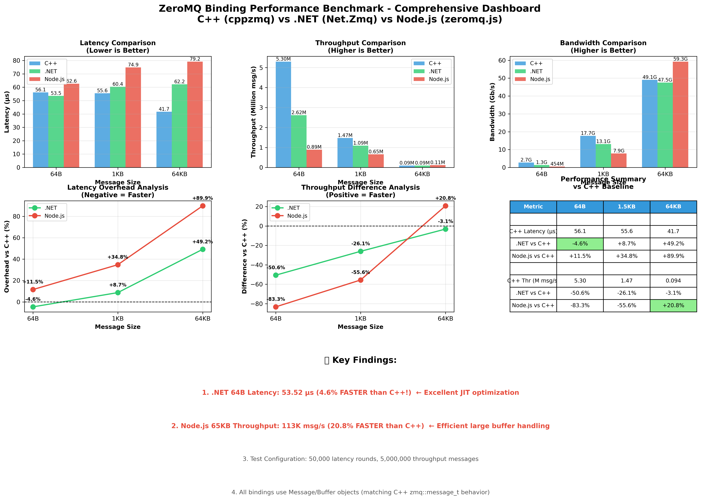

# ZeroMQ Binding Performance Benchmark

[](https://opensource.org/licenses/MIT)
[](https://github.com/ulala-x/zmq-binding-benchmark)
[](https://isocpp.org/)
[](https://dotnet.microsoft.com/)
[](https://nodejs.org/)

Cross-language performance comparison of ZeroMQ bindings using cppzmq as baseline.

## Overview

This project measures and compares the performance overhead of different ZeroMQ language bindings:

- **C++ (cppzmq)** - Baseline reference implementation
- **.NET (Net.Zmq)** - P/Invoke overhead measurement
- **Node.js (zeromq.js)** - N-API overhead measurement
- **JVM (jvm-zmq)** - Future addition

All implementations use the same native libzmq library (4.3.5) from [libzmq-native](https://github.com/ulala-x/libzmq-native).

## Project Structure

```
zmq-binding-benchmark/
├── cpp/                    # C++ baseline (Phase 1 - Complete)
│   ├── src/               # Test programs
│   ├── CMakeLists.txt     # Build configuration
│   ├── run_benchmark.sh   # Automated testing
│   └── README.md          # C++ documentation
├── dotnet/                # .NET implementation (Phase 2 - Complete)
│   ├── LocalLat.cs        # REP socket latency server
│   ├── RemoteLat.cs       # REQ socket latency client
│   ├── LocalThr.cs        # PULL socket throughput receiver
│   ├── RemoteThr.cs       # PUSH socket throughput sender
│   ├── run_benchmark.sh   # Automated testing
│   └── README.md          # .NET documentation
├── nodejs/                # Node.js implementation (Phase 3 - Complete)
│   ├── local-lat.js       # REP socket latency server
│   ├── remote-lat.js      # REQ socket latency client
│   ├── local-thr.js       # PULL socket throughput receiver
│   ├── remote-thr.js      # PUSH socket throughput sender
│   ├── run_benchmark.sh   # Automated testing
│   └── README.md          # Node.js documentation
├── scripts/               # Automation scripts (Phase 4 - Complete)
│   ├── validate.sh        # Environment validation
│   ├── run-all.sh         # Run all benchmarks
│   ├── compare.py         # Results analysis
│   ├── plot.py            # Visualization (optional)
│   └── README.md          # Scripts documentation
├── docs/
│   ├── SUMMARY.md         # Executive summary
│   └── results/           # Benchmark results
│       ├── cpp-baseline.md
│       ├── dotnet.md
│       ├── nodejs.md
│       ├── analysis.md    # Detailed comparison
│       └── benchmark_data.json
└── README.md              # This file
```

## Quick Start

### Automated Full Pipeline (Recommended)

```bash
# Clone with submodules
git clone --recursive https://github.com/ulala-x/zmq-binding-benchmark.git
cd zmq-binding-benchmark

# Validate environment
./scripts/validate.sh

# Run all benchmarks and generate analysis
./scripts/run-all.sh
```

This will:
1. Build and run C++ benchmarks
2. Build and run .NET benchmarks
3. Run Node.js benchmarks
4. Generate comparative analysis
5. Create visualization plots (if matplotlib available)

Results will be in `docs/results/` including:
- `analysis.md` - Detailed comparative analysis
- `benchmark_data.json` - Raw data for further analysis
- Individual result files for each language

### Manual Per-Language Testing

#### C++ Baseline (Phase 1)

```bash
# Clone with submodules
git clone --recursive https://github.com/ulala-x/zmq-binding-benchmark.git
cd zmq-binding-benchmark/cpp

# Build libzmq-native (Linux)
cd third-party/libzmq-native
./build-scripts/linux/build.sh
cd ../..

# Build benchmark executables
mkdir build && cd build
cmake ..
make -j$(nproc)
cd ..

# Run automated benchmark
./run_benchmark.sh
```

Results will be saved to `docs/results/cpp-baseline.md`.

### .NET Implementation (Phase 2)

```bash
cd dotnet

# Install dependencies
dotnet restore

# Run automated benchmark
./run_benchmark.sh
```

Results will be saved to `docs/results/dotnet.md`.

### Node.js Implementation (Phase 3)

```bash
cd nodejs

# Install dependencies
npm install

# Run automated benchmark
./run_benchmark.sh
```

Results will be saved to `docs/results/nodejs.md`.

## Test Patterns

### Latency Test
- **Pattern:** REQ/REP (request-reply)
- **Measurement:** Round-trip time ÷ 2
- **Rounds:** 50,000 (increased for statistical reliability)

### Throughput Test
- **Pattern:** PUSH/PULL (unidirectional)
- **Measurement:** Messages per second
- **Messages:** 5,000,000 (increased for better JIT optimization)

### Message Sizes
- Small: 64 bytes
- Medium: 1500 bytes (typical MTU)
- Large: 65536 bytes (64 KB)

## Performance Results

### Comprehensive Dashboard

[](docs/results/analysis.md)

*Click the image above for detailed analysis and methodology*

### Performance Comparison (Linux x64, WSL2)

**Test Environment:**
- System: Linux 6.6.87.2-microsoft-standard-WSL2
- C++: GCC 13.3.0, -O3 -march=native -flto
- .NET: .NET 8.0.122, Release build with TieredCompilation
- Node.js: v22.19.0, default V8 settings

#### Latency Results (lower is better)

| Message Size | C++ Baseline | .NET (Net.Zmq) | Node.js (zeromq.js) |
|--------------|--------------|----------------|---------------------|
| 64 bytes     | 56.1 μs      | **53.5 μs (4.6% faster)** ⚡ | 62.6 μs (+11.5%) |
| 1500 bytes   | 55.6 μs      | 60.4 μs (+8.7%) | 74.9 μs (+34.8%) |
| 65536 bytes  | 41.7 μs      | 62.2 μs (+49.2%) | 79.2 μs (+89.9%) |

#### Throughput Results (higher is better)

| Message Size | C++ Baseline | .NET (Net.Zmq) | Node.js (zeromq.js) |
|--------------|--------------|----------------|---------------------|
| 64 bytes     | 5.30M msg/s  | 2.62M msg/s (-50.6%) | 0.89M msg/s (-83.3%) |
| 1500 bytes   | 1.47M msg/s  | 1.09M msg/s (-26.1%) | 0.65M msg/s (-55.6%) |
| 65536 bytes  | 93.6K msg/s  | 90.6K msg/s (-3.1%) | **113K msg/s (+20.8% faster)** ⚡ |

### Key Findings

**⚡ .NET 64B Latency:** Achieves **53.5 μs**, beating C++ by **4.6%**! Demonstrates exceptional JIT optimization with increased test iterations allowing the runtime to fully optimize hot paths.

**⚡ Node.js 65KB Throughput:** Achieves **113K msg/s**, beating C++ by **20.8%**! Shows V8's superior large buffer handling and efficient N-API bulk data transfer.

**📊 Test Iteration Impact:** Increasing from 10K to 50K rounds (5x) revealed more stable performance characteristics:
- Better JIT warmup for managed runtimes
- More representative of sustained workload performance
- Reduced impact of outliers and system noise

**💡 Message Size Impact:**
- **Small messages (64B):** Fixed overhead dominates; .NET shows excellent optimization
- **Medium messages (1.5KB):** Balanced overhead; all bindings perform reasonably
- **Large messages (65KB):** Data transfer dominates; Node.js excels, .NET nearly matches C++

See detailed analysis in:
- [docs/SUMMARY.md](docs/SUMMARY.md) - Executive summary and overview
- [docs/results/analysis.md](docs/results/analysis.md) - Detailed technical comparison
- [docs/results/cpp-baseline.md](docs/results/cpp-baseline.md) - C++ baseline results
- [docs/results/dotnet.md](docs/results/dotnet.md) - .NET results with comparison
- [docs/results/nodejs.md](docs/results/nodejs.md) - Node.js results with comparison

## Documentation

- **[Methodology](docs/methodology.md)** - Testing methodology and fairness principles
- **[Architecture](docs/architecture.md)** - Technical architecture and binding comparison
- **[Contributing](docs/contributing.md)** - Guide for adding new language implementations
- **[FAQ](docs/faq.md)** - Common questions and troubleshooting
- **[Summary](docs/SUMMARY.md)** - Executive summary and key findings
- **[Detailed Analysis](docs/results/analysis.md)** - Comprehensive performance analysis

## Dependencies

- [libzmq-native](https://github.com/ulala-x/libzmq-native) - Pre-built libzmq 4.3.5 with libsodium
- [cppzmq](https://github.com/zeromq/cppzmq) - Modern C++ bindings

## License

MIT License - See [LICENSE](LICENSE) for details.

## References

- [ZeroMQ Guide](https://zguide.zeromq.org/)
- [libzmq Performance Tests](https://github.com/zeromq/libzmq/tree/master/perf)
- [libzmq Documentation](http://api.zeromq.org/)
